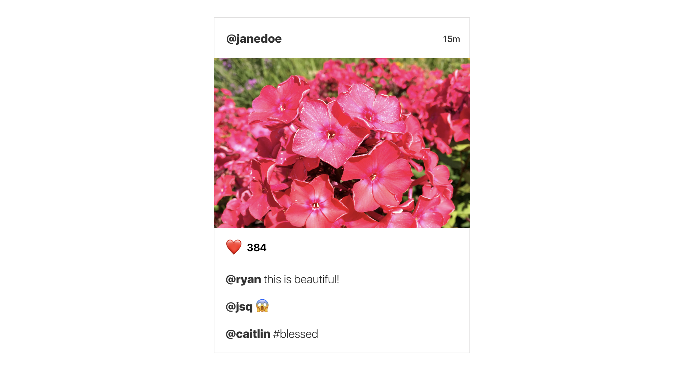

# Modeling and Binding

This guide will walk you through a practical example of taking an app spec/design and turning it into a working `IGListKit` project.

You will learn how to:

- Turn a design spec into a top-level model and view models
- Use `ListBindingSectionController` for animated, one-way cell updates
- Cell-to-controller action handling and delegation
- Updating the UI with local data mutations

## Getting Started

You can follow along and build the example in this guide. First, you must download [this starter project](https://github.com/rnystrom/IGListKit-Binding-Guide). Open **ModelingAndBinding-Starter/ModelingAndBinding.xcworkspace** since the base project is setup with CocoaPods with `IGListKit` already added as a dependency.

Take a look at the following Instagram-inspired list element design:



You can already start mentally modelling your data:

- The top cell has a **username** and **timestamp** label
- The image cell will need some sort of image `URL`
- An action cell with **like count**. There will also need to be some sort of action handling when someone taps the heart
- Then there are a _dynamic_ number of comment cells that contain a **username** and **comment**

Remember that `IGListKit` functions on **one model per section controller**. All of the cells in this design correlate to one top-level "post" object delivered by a server. You want to create a `Post` model that contains all of the information that the cells require.

> A common mistake is to create a single model and section controller for a single cell. In this example, that will create a **very confusing** architecture since the top-level objects will contain a mix and match of user, image, action, and comment models.

## Creating Models

Create a new file named **Post.swift** in the starter project:

```swift
import IGListKit

final class Post: ListDiffable {

  // 1
  let username: String
  let timestamp: String
  let imageURL: URL
  let likes: Int
  let comments: [Comment]

  // 2
  init(username: String, timestamp: String, imageURL: URL, likes: Int, comments: [Comment]) {
    self.username = username
    self.timestamp = timestamp
    self.imageURL = imageURL
    self.likes = likes
    self.comments = comments
  }

}
```

1. It's best practice to always declare your values as `let` so they cannot be mutated again. The compiler will complain about the `Comment` model, ignore that for now.
2. Since `IGListKit` is compatible with Objective-C, your models must be `class`es which means writing initializers. It's only a little copy & paste!

Now add a `ListDiffable` implementation inside of `Post`:

```swift
// MARK: ListDiffable

func diffIdentifier() -> NSObjectProtocol {
  // 1
  return (username + timestamp) as NSObjectProtocol
}

// 2
func isEqual(toDiffableObject object: ListDiffable?) -> Bool {
  return true
}
```

1. Derive a **unique identifier** for each post. Since a single post should never have the same `username` and `timestamp` combo, we can start with that.
2. A **core requirement** to using `ListBindingSectionController` is that if two models have the same `diffIdentifier`, they **must be equal** so that the section controller can then compare view models.

### View Models

Create a new Swift file named **Comment.swift** and try writing the `Comment` model yourself:

- `username` of type `String`
- `text` of type `String`
- You will be diffing this model eventually, so add a `ListDiffable` implementation

If you get stuck, or just want to copy & paste, you can reveal the implementation below.

<details>
  <summary>Comment implementation</summary>
  <p>

```swift
import IGListKit

final class Comment: ListDiffable {

    let username: String
    let text: String

    init(username: String, text: String) {
        self.username = username
        self.text = text
    }

    // MARK: ListDiffable

    func diffIdentifier() -> NSObjectProtocol {
        return (username + text) as NSObjectProtocol
    }

    func isEqual(toDiffableObject object: ListDiffable?) -> Bool {
        return true
    }

}
```

A note on the `isEqual(toDiffableObject:)` implementation: Whatever you use to derive the `diffIdentifier` can be omitted from any equality checks, since by definition the objects have already matched on their identifiers.

In this case, the `username` and `text` **must be equal** by the time two objects are checked for equality.

</p></details>

Using the `Comment` array on a `Post` should make some sense: there are a dynamic number of comments on each post. For each comment, you want to display a cell.

What might be a little bit of a new concept, though, is that you need to create models for the `UserCell`, `ImageCell`, _and_ `ActionCell` as well when working with `ListBindingSectionController`.

> A binding section controller is almost like a mini-`IGListKit`. It takes an array of view models and turns them into configured cells. Get into the habit of creating a new model for each cell type within an `ListBindingSectionController` instance.

With that in mind, let's start with the model for the `UserCell`:

Create a new Swift file called **UserViewModel.swift**:

```swift
import IGListKit

final class UserViewModel: ListDiffable {

  let username: String
  let timestamp: String

  init(username: String, timestamp: String) {
    self.username = username
    self.timestamp = timestamp
  }

  // MARK: ListDiffable

  func diffIdentifier() -> NSObjectProtocol {
    // 1
    return "user" as NSObjectProtocol
  }

  func isEqual(toDiffableObject object: ListDiffable?) -> Bool {
    // 2
    guard let object = object as? UserViewModel else  { return false }
    return username == object.username
    && timestamp == object.timestamp
  }

}
```

1. Since there will only be **one `UserViewModel` per `Post`**, you can hardcode an identifier. This will enforce only a single model & cell being used.
2. It's important to write a good equality method for these view models. Anytime something changes, forcing the models to not be equal, the cell will be refreshed.

Try to make view models for the **image** and **action** cell. Remember there is only a single cell per `Post`, so you can use `UserViewModel` as a starting point for how the models should look.

<details>
  <summary>View model implementations</summary>
  <p>

```swift
import IGListKit

final class ImageViewModel: ListDiffable {

  let url: URL

  init(url: URL) {
    self.url = url
  }

  // MARK: ListDiffable

  func diffIdentifier() -> NSObjectProtocol {
    return "image" as NSObjectProtocol
  }

  func isEqual(toDiffableObject object: ListDiffable?) -> Bool {
    guard let object = object as? ImageViewModel else { return false }
    return url == object.url
  }

}

final class ActionViewModel: ListDiffable {

  let likes: Int

  init(likes: Int) {
    self.likes = likes
  }

  // MARK: ListDiffable

  func diffIdentifier() -> NSObjectProtocol {
    return "action" as NSObjectProtocol
  }

  func isEqual(toDiffableObject object: ListDiffable?) -> Bool {
    guard let object = object as? ActionViewModel else { return false }
    return likes == object.likes
  }
  
}
```

> You could try getting away with using generics since these models look so similar, but we've found that using **simple** models makes long-term maintenance more manageable.

</p></details>

## Using ListBindingSectionController

You now have the following view models, which can all be derived from each `Post`:

- `UserViewModel`
- `ImageViewModel`
- `ActionViewModel`
- `Comment`

Let's start using these models to power cells using `ListBindingSectionController`. This controller takes a top-level model (`Post`), asks its data source for an array of diffable view models (our view models above), then binds those view models to cells (provided in the starter project).


Create **PostSectionController.swift** and add the following code:

```swift
final class PostSectionController: ListBindingSectionController<Post>,
ListBindingSectionControllerDataSource {

  override init() {
    super.init()
    dataSource = self
  }

}
```

Notice that you are subclassing `ListBindingSectionController<Post>`. This declares your section controller as receiving a `Post` model. That way you don't have to do any special casting of your model.

There are 3 methods that are required to satisfy the data source protocol:

- Return an array of view models given the top-level model (`Post`)
- Return a size for a given view model
- Return a cell for a given view model

First take care of the `Post`-to-view-models transformation:

```swift
// MARK: ListBindingSectionControllerDataSource

func sectionController(
  _ sectionController: ListBindingSectionController<ListDiffable>,
  viewModelsFor object: Any
  ) -> [ListDiffable] {
    // 1
    guard let object = object as? Post else { fatalError() }
    // 2
    let results: [ListDiffable] = [
      UserViewModel(username: object.username, timestamp: object.timestamp),
      ImageViewModel(url: object.imageURL),
      ActionViewModel(likes: object.likes)
    ]
    // 3
    return results + object.comments
}
```

1. The `object` property **must** be optional because it will not exist upon section controller initialization. However, it should never be nil at this point, nor should the `object: Any` parameter be anything but the section controller type. This is a limitation of Objective-C generics and protocols, so doing a `fatalError()` here is appropriate.
2. Create your array of view models by _decomposing_ the `Post` model into smaller models.
3. You can even append dynamic models that are delivered from the server.

Next add the required API to return a size for each view model:

```swift
func sectionController(
  _ sectionController: ListBindingSectionController<ListDiffable>,
  sizeForViewModel viewModel: Any,
  at index: Int
  ) -> CGSize {
  // 1
  guard let width = collectionContext?.containerSize.width else { fatalError() }
  // 2
  let height: CGFloat
  switch viewModel {
  case is ImageViewModel: height = 250
  case is Comment: height = 35
  // 3
  default: height = 55
  }
  return CGSize(width: width, height: height)
}
```

1. Just like the `object` property, the `collectionContext` should never be `nil`, but it's a weakly referenced object so must be declared as optional. Again, use `fatalError()` to catch any critical failures.
2. Swift makes checking for types so easy! Just `switch` on the type and assign a height. In Objective-C you should use `isKindOfClass:`.
3. Both the `UserViewModel` and `ActionViewModel` share the same height of `55`pts according to the design.

Lastly, implement the API that returns a cell for each view model. This should look similar to the size API above. Give it a try yourself.

> Remember that the cells are defined in **Main.storyboard**. You can click on each cell to view their identifiers.

<details>
  <summary>"cellForViewModel:" implementation</summary>
  <p>

```swift
func sectionController(
  _ sectionController: ListBindingSectionController<ListDiffable>,
  cellForViewModel viewModel: Any,
  at index: Int
  ) -> UICollectionViewCell {
  let identifier: String
  switch viewModel {
  case is ImageViewModel: identifier = "image"
  case is Comment: identifier = "comment"
  case is UserViewModel: identifier = "user"
  default: identifier = "action"
  }
  guard let cell = collectionContext?
    .dequeueReusableCellFromStoryboard(withIdentifier: identifier, for: self, at: index)
    else { fatalError() }
  return cell
}
```

Remember to handle `UserViewModel` and `ActionViewModel` separately!

</p></details>

## Binding Models to Cells

Now you have `PostSectionController` setup to create view models, sizes, and cells. The last piece to using `ListBindingSectionController` is having your cells to receive its assigned view model and configure itself. 

This is done by making your cells conform to `ListBindable`. With that, `ListBindingSectionController` will **automatically** bind view models to each cell!

Open **ImageCell.swift** and change the implementation to look like the following:

```swift
import UIKit
import SDWebImage
// 1
import IGListKit

// 2
final class ImageCell: UICollectionViewCell, ListBindable {

  @IBOutlet weak var imageView: UIImageView!

  // MARK: ListBindable

  func bindViewModel(_ viewModel: Any) {
    // 3
    guard let viewModel = viewModel as? ImageViewModel else { return }
    // 4
    imageView.sd_setImage(with: viewModel.url)
  }

}
```

1. Make sure to import `IGListKit`!
2. Have the cell conform to `ListBindable`
3. Guard against the view model type. This will always be what `PostSectionController` pairs the cell with in `cellForViewModel:`, but guard to be safe.
4. Use the [SDWebImage](https://github.com/rs/SDWebImage) library to set the image URL.

Now do exactly the same thing for each of the other cells:

- `ActionCell` binds `ActionViewModel`
- `UserCell` binds `UserViewModel`
- `CommentCell` binds `Comment`

<details>
  <summary>ListBindable implementations</summary>
  <p>

```swift
final class ActionCell: UICollectionViewCell, ListBindable {

  @IBOutlet weak var likesLabel: UILabel!
  @IBOutlet weak var likeButton: UIButton!

  // MARK: ListBindable

  func bindViewModel(_ viewModel: Any) {
    guard let viewModel = viewModel as? ActionViewModel else { return }
    likesLabel.text = "\(viewModel.likes)"
  }

}

final class UserCell: UICollectionViewCell, ListBindable {

  @IBOutlet weak var usernameLabel: UILabel!
  @IBOutlet weak var dateLabel: UILabel!

  // MARK: ListBindable

  func bindViewModel(_ viewModel: Any) {
    guard let viewModel = viewModel as? UserViewModel else { return }
    usernameLabel.text = viewModel.username
    dateLabel.text = viewModel.timestamp
  }

}

final class CommentCell: UICollectionViewCell, ListBindable {

  @IBOutlet weak var usernameLabel: UILabel!
  @IBOutlet weak var commentLabel: UILabel!

  // MARK: ListBindable

  func bindViewModel(_ viewModel: Any) {
    guard let viewModel = viewModel as? Comment else { return }
    usernameLabel.text = viewModel.username
    commentLabel.text = viewModel.text
  }

}
```
</p></details>

## Displaying in the View Controller

The very last step is getting the `PostSectionController` displaying in the app's list.

Go back to **ViewController.swift** and add the following to `viewDidLoad()`, **before** setting the `dataSource` or `collectionView`:

```swift
data.append(Post(
  username: "@janedoe",
  timestamp: "15min",
  imageURL: URL(string: "https://placekitten.com/g/375/250")!,
  likes: 384,
  comments: [
    Comment(username: "@ryan", text: "this is beautiful!"),
    Comment(username: "@jsq", text: "😱"),
    Comment(username: "@caitlin", text: "#blessed"),
  ]
))
```

Lastly, update `listAdapter(_, sectionControllerFor object:)`:

```swift
func listAdapter(
  _ listAdapter: ListAdapter,
  sectionControllerFor object: Any
  ) -> ListSectionController {
  return PostSectionController()
}
```

> Normally you'd want to check the type of `object`, but since you're only using `Post` at this point, it's safe to simply return a new `PostSectionController`.

**Build and run** the sample app to see your post show up!


## Handling Cell Actions

This design should respond to tapping the heart icon on the `ActionCell`. In order to do that, you need to handle taps on the `UIButton`, then forward the event to the `PostSectionController`:

Open **ActionCell.swift** and add the following protocol:

```swift
protocol ActionCellDelegate: class {
  func didTapHeart(cell: ActionCell)
}
```

Add a new delegate variable to the `ActionCell`, beneath the outlets:

```swift
weak var delegate: ActionCellDelegate? = nil
```

Override `awakeFromNib()` and add a target & action to the `likeButton`:

```swift
override func awakeFromNib() {
  super.awakeFromNib()
  likeButton.addTarget(self, action: #selector(ActionCell.onHeart), for: .touchUpInside)
}
```

The last thing you need to do in **ActionCell.swift** is add an implementation for `onHeart()`:

```swift
func onHeart() {
  delegate?.didTapHeart(cell: self)
}
```

This will forward the button tap outside of the cell and to the delegate.

Open **PostSectionController.swift** and update the `cellForViewModel:` method. Add the following at the end of the method, just after the `guard` and right before you return the `cell`:

```swift
if let cell = cell as? ActionCell {
  cell.delegate = self
}
```

The compiler will immediately complain. Satisfy the compiler but adding an empty implementation to `PostSectionController`:

```swift
final class PostSectionController: ListBindingSectionController<Post>,
ListBindingSectionControllerDataSource,
ActionCellDelegate {

//...

// MARK: ActionCellDelegate

func didTapHeart(cell: ActionCell) {
  print("like")
}
```

**Build and run** the app and tap on the heart button. You should see "like"s printing into the console.

## Local Mutations

Every time someone taps the heart button, you need to add a new like to the `Post`. However, all of your models are declared with `let` because immutable models are a much safer design. But if everything is immutable, how do we mutate the like count?

The `PostSectionController` is the _perfect_ place to handle and store mutations. Open **PostSectionController.swift** and add the following variable:

```swift
var localLikes: Int? = nil
```

Go back to the `didTapHeart(cell:)` delegate method and change the implementation to the following:

```swift
func didTapHeart(cell: ActionCell) {
  // 1
  localLikes = (localLikes ?? object?.likes ?? 0) + 1
  // 2
  update(animated: true)
}
```

1. Mutate the `localLikes` variable using either the previous `localLikes` or starting with `object.likes`, whichever exists. Fallback to `0` which will never happen, just satisfying the compiler.
2. Call the `update(animated:,completion:)` API on `ListBindingSectionController` to refresh the cells on the screen.

In order to actually send the mutations to the models, you need to start using `localLikes` with the `ActionViewModel` which is given to the `ActionCell`.

Still in **PostSectionController.swift**, find the `cellForViewModel:` API and change the `ActionViewModel` initialization to the following:

```swift
ActionViewModel(likes: localLikes ?? object.likes)
```

**Build and run** the app, tap on the heart button, and see your likes increment!

<p align="center">
  
</p>

## Wrapping up

If you got stuck at all, or just want to play around with the example, you can find the finished project [here](https://github.com/rnystrom/IGListKit-Binding-Guide) in **ModelingAndBinding/ModelingAndBinding.xcworkspace**.

`ListBindingSectionController` is one of the most powerful features that we've built for `IGListKit` because it further encourages you to design small, composable models, views, and controllers.

You can also use the section controller to handle any interactions, as well as deal with mutations, just like a controller should!

If you have suggestions for other topics you'd like to see, or want to offer a correction, please create a [new issue](https://github.com/Instagram/IGListKit/issues/new)!