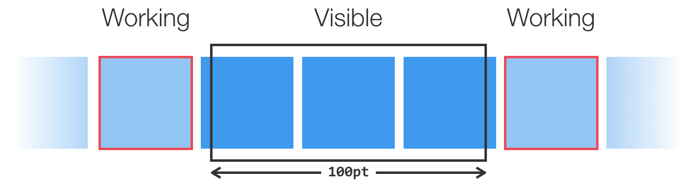

<p align="center">
  
</p>

[](https://travis-ci.org/Instagram/IGListKit) [](https://cocoapods.org/pods/IGListKit) [](https://opensource.org/licenses/BSD-3-Clause) [](https://instagram.github.io/IGListKit) [](https://github.com/Carthage/Carthage)

------------------------

A data-driven `UICollectionView` framework for building fast and flexible lists.

         | Main Features
---------|---------------
&#128581; | Never call `performBatchUpdates(_:, completion:)` or `reloadData()` again
&#127968; | Better architecture with reusable cells and components
&#128288; | Create collections with multiple data types
&#128273; | Decoupled diffing algorithm
&#9989; | Fully unit tested
&#128269; | Customize your diffing behavior for your models
&#128241; | Simply `UICollectionView` at its core
&#128640; | Extendable API
&#128038; | Written in Objective-C with full Swift interop support

`IGListKit` is built and maintained by [Instagram engineering](https://engineering.instagram.com/), using the open source version for the Instagram app.

## Installation

The preferred installation method for `IGListKit` is with [CocoaPods](http://cocoapods.org). Simply add the following to your Podfile:

```ruby
# Latest release of IGListKit
pod 'IGListKit'
```

You can also manually install the framework by dragging and dropping the `IGListKit.xcodeproj` into your workspace.

`IGListKit` supports a minimum iOS version of 8.0.

## Creating your first list

After installing `IGListKit`, creating a new list is really simple.

### Creating a section controller

Creating a new section controller is very simple. You just subclass `IGListSectionController` and conform to the `IGListSectionType` protocol. Once you conform to `IGListSectionType`, the compiler will make sure you implement all of the required methods.

Take a look at [LabelSectionController](https://github.com/Instagram/IGListKit/blob/master/Example/IGListKitExamples/SectionControllers/LabelSectionController.swift) for an example section controller that handles a `String` and configures a single cell with a `UILabel`.

```swift
class LabelSectionController: IGListSectionController, IGListSectionType {
  // ...
}
```

### Creating the UI

After creating at least one section controller, you must create an `IGListCollectionView` and `IGListAdapter`.

```swift
let layout = UICollectionViewFlowLayout()
let collectionView = IGListCollectionView(frame: CGRect.zero, collectionViewLayout: layout)

let updater = IGListAdapterUpdater()
let adapter = IGListAdapter(updater: updater, viewController: self, workingRangeSize: 0)
adapter.collectionView = collectionView
```

> **Note:** This example is done within a `UIViewController` and uses both a stock `UICollectionViewFlowLayout` and `IGListAdapterUpdater`. You can use your own layout and updater if you need advanced features!

### Connecting a data source

The last step is the `IGListAdapter`'s data source and returning some data.

```swift
func objectsForListAdapter(listAdapter: IGListAdapter) -> [IGListDiffable] {
  // this can be anything!
  return [ "Foo", "Bar", 42, "Biz" ]
}

func listAdapter(listAdapter: IGListAdapter,
    sectionControllerForObject(object: Any) -> IGListSectionController {
  if object is String {
    return LabelSectionController()
  } else {
    return NumberSectionController()
  }
}

func emptyViewForListAdapter(listAdapter: IGListAdapter) -> UIView? {
  return nil
}
```

You can return an array of _any_ type of data, as long as it conforms to `IGListDiffable`. We've included a [default implementation](https://github.com/Instagram/IGListKit/blob/master/Source/NSObject%2BIGListDiffable.m) for all objects, but adding your own implementation can unlock even better diffing.

## Diffing

`IGListKit` uses an algorithm adapted from a paper titled [A technique for isolating differences between files](http://dl.acm.org/citation.cfm?id=359467&dl=ACM&coll=DL) by Paul Heckel. This algorithm uses a technique known as the *longest common subsequence* to find a minimal diff between collections in linear time `O(n)`. It finds all **inserts**, **deletes**, **updates**, and **moves** between arrays of data.

To add custom, diffable models, you need to conform to the `IGListDiffable` protocol and implement `diffIdentifier()` and `isEqual(_:)`.

For an example, consider the following model:

```swift
class User {
  let primaryKey: Int
  let name: String
  // implementation, etc
}
```

The user's `primaryKey` uniquely identifies user data, and the `name` is just the value for that user.

Consider the following two users:

```swift
let shayne = User(primaryKey: 2, name: "Shayne")
let ann = User(primaryKey: 2, name: "Ann")
```

Both `shayne` and `ann` represent the same *unique* data because they share the same `primaryKey`, but they are not *equal* because their names are different.

To represent this in `IGListKit`'s diffing, add and implement the `IGListDiffable` protocol:

```swift
extension User: IGListDiffable {
  func diffIdentifier() -> NSObjectProtocol {
    return pk
  }

  func isEqual(object: Any?) -> Bool {
    if let object = object as? User {
      return name == object.name
    }
    return false
  }
}
```

The algorithm will skip updating two `User` objects that have the same `primaryKey` and `name`, even if they are different instances! You now avoid unecessary UI updates in the collection view even when providing new instances.

> **Note:** Remember that `isEqual(_:)` should return `false` when you want to reload the cells in the corresponding section controller.

### Diffing outside of IGListKit

If you want to use the diffing algorithm outside of `IGListAdapter` and `UICollectionView`, you can! The diffing algorithm was built with the flexibility to be used with any models that conform to `IGListDiffable`.

```swift
let result = IGListDiff(oldUsers, newUsers, .equality)
```

With this you have all of the deletes, reloads, moves, and inserts! There's even a function to generate `NSIndexPath` results.

## Advanced Features

### Working Range

A *working range* is a distance before and after the visible bounds of the `UICollectionView` where section controllers within this bounds are notified of their entrance and exit. This concept lets your section controllers **prepare content** before they come on screen (e.g. download images).

The `IGListAdapter` must be initialized with a range value in order to work. This value is a multiple of the visible height or width, depending on the scroll-direction.

```swift
let adapter = IGListAdapter(updater: IGListAdapterUpdater(),
                     viewController: self,
                   workingRangeSize: 0.5) // 0.5x the visible size
```



You can set the weak `workingRangeDelegate` on an section controller to receive events.

### Supplementary Views

Adding supplementary views to section controllers is as simple as setting the weak `supplementaryViewSource` and implementing the `IGListSupplementaryViewSource` protocol. This protocol works nearly the same as returning and configuring cells.

### Display Delegate

Section controllers can set the weak `displayDelegate` delegate to an object, including `self`, to receive display events about a section controller and individual cells.

### Custom Updaters

The default `IGListAdapterUpdater` should handle any `UICollectionView` update that you need. However, if you find the functionality lacking, or want to perform updates in a very specific way, you can create an object that conforms to the `IGListUpdatingDelegate` protocol and initialize a new `IGListAdapter` with it.

Check out the updater `IGListReloadDataUpdater` (used in unit tests) for an example.

## Documentation

You can find [the docs here](https://instagram.github.io/IGListKit). Documentation is generated with [jazzy](https://github.com/realm/jazzy) and hosted on [GitHub-Pages](https://pages.github.com).

## Contributing

Please see the [CONTRIBUTING](CONTRIBUTING.md) file for how to help out. At Instagram we sync the open source version of `IGListKit` almost daily, so we're always testing the latest changes. But that requires all changes be thoroughly tested follow our style guide.

## License

`IGListKit` is BSD-licensed. We also provide an additional patent grant.

The files in the /Example directory are licensed under a separate license as specified in each file; documentation is licensed [CC-BY-4.0](https://creativecommons.org/licenses/by/4.0/).
