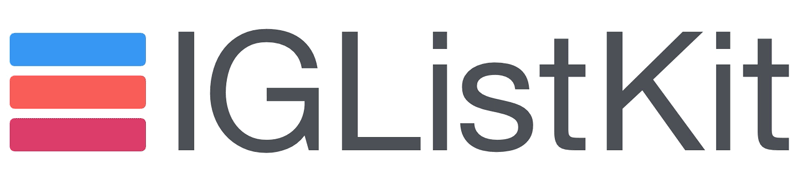

<p align="center">
  
</p>

<!--
[](https://travis-ci.org/Instagram/IGListKit)
[][podLink] [][mitLink]
[](https://codecov.io/gh/Instagram/IGListKit)
[][docsLink]
-->

------------------------

A data-driven `UICollectionView` framework for building fast and flexible feeds.

         | Main Features
---------|---------------
:no_good: | Never call `performBatchUpdates(_:, completion:)` or `reloadData()` again
:house: | Better architecture with reusable cells and feed components
:capital_abcd: | Create feeds with multiple data types
:mag: | Customize your diffing behavior for your models
:white_check_mark: | Fully unit tested
:iphone: | Simply `UICollectionView` at its core
:rocket: | Extendable updating API
:key: | Decoupled diffing algorithm
:bulb: | Display and near-display delegate events

`IGListKit` powers every major product in Instagram for hundreds of millions of users. It was built to be fast, efficient, and stable.

## Installation

The preferred installation method for `IGListKit` is with [Cocoapods](http://cocoapods.org). Simply add the following to your Podfile:

```ruby
# Latest release of IGListKit
pod 'IGListKit'
```

You can also manually install the framework by dragging and dropping the `IGListKit.xcodeproj` into your workspace.

`IGListKit` supports a minimum iOS version of 8.0.

## Creating your first feed

After installing `IGListKit`, creating a new feed is really simple.

### Creating an item controller

Creating a new item controller is very simple. You just subclass `IGListItemController` and conform to the `IGListItemType` protocol. Once you conform to `IGListItemType`, the compiler will make sure you implement all of the required methods.

Take a look at [LabelItemController](TODO URL) for an example item controller that handles a `String` and configures a single cell with a `UILabel`.

```swift
class LabelItemController: IGListItemController, IGListItemType {
  // ...
}
```

### Creating the UI

After creating at least one item controller, you must create an `IGListCollectionView` and `IGListAdapter`.

```swift
let layout = UICollectionViewFlowLayout()
let collectionView = IGListCollectionView(frame: CGRect.zero, collectionViewLayout: layout)

let updater = IGListAdapterUpdater()
let adapter = IGListAdapter(updatingDelegate: updater, viewController: self, workingRangeSize: 0)
adapter.collectionView = collectionView
```

> **Note:** This example is done within a `UIViewController` and uses both a stock `UICollectionViewFlowLayout` and `IGListAdapterUpdater`. You can use your own layout and updater if you need advanced features!

### Connecting a data source

The last step is the `IGListAdapter`'s data source and returning some data.

```swift
func itemsForListAdapter(listAdapter: IGListAdapter) -> [IGListDiffable] {
  // this can be anything!
  return [ "Foo", "Bar", 42, "Biz" ]
}

func listAdapter(listAdapter: IGListAdapter,
    itemControllerForItem item: AnyObject) -> IGListItemController {
  if let _ = item as? String {
    return LabelItemController()
  } else {
    return NumberItemController()
  }
}

func emptyViewForListAdapter(listAdapter: IGListAdapter) -> UIView? {
  return nil
}
```

You can return an array of _any_ type of data, as long as it conforms to `IGListDiffable`. We've included a [default implementation](TODO URL) for all objects, but adding your own implementation can unlock even better diffing.

## Diffing

`IGListKit` uses an algorithm adapted from a paper titled [A technique for isolating differences between files](http://dl.acm.org/citation.cfm?id=359467&dl=ACM&coll=DL) by Paul Heckel. This algorithm uses a technique known as the *longest common subsequence* to find a minimal diff between collections in linear time `O(n)`. It finds all **inserts**, **deletes**, **updates**, and **moves** between arrays of data.

To add custom, diffable models, you need to conform to the `IGListDiffable` protocol and implement `diffIdentifier()` and `isEqual(_:)`.

For an example, consider the following model:

```swift
class User {
  let primaryKey: Int
  let name: String
  // implementation, etc
}
```

The user's `primaryKey` uniquely identifies user data, and the `name` is just the value for that user.

Consider the following two users:

```swift
let jack = User(primaryKey: 2, name: "Jack")
let jill = User(primaryKey: 2, name: "Jill")
```

Both `jack` and `jill` represent the same *unique* data because they share the same `primaryKey`, but they are not *equal* because their names are different.

To represent this in `IGListKit`'s diffing, add and implement the `IGListDiffable` protocol:

```swift
extension User: IGListDiffable {
  func diffIdentifier() -> NSObjectProtocol {
    return pk
  }

  func isEqual(object: AnyObject?) -> Bool {
    if object === self {
      return true
    }
    if let object = object as? User {
      return name == object.name
    }
    return false
  }
}
```

The algorithm will skip updating two `User` objects that have the same `primaryKey` and `name`, even if they are different instances! You now avoid unecessary UI updates in the collection view even when providing new instances.

> **Note:** Remember that `isEqual(_:)` should return `false` when you want to reload the cells in the corresponding item controller.

## Advanced Features

### Delegates

**Supplementary Views**

Adding supplementary views to item controllers is as simple as setting the weak `supplementaryViewSource` and implementing the `IGListSupplementaryViewSource` protocol. This protocol works nearly the same as returning and configuring cells.

**Display Delegate**

Item controllers can set the weak `displayDelegate` delegate to an object, including `self`, to receive display events about an item controller and individual cells.

**Working Range**

A *working range* is a distance before and after the visible bounds of the `UICollectionView` where item controllers within this bounds are notified of their entrance and exit. This concept lets your item controllers **prepare content** before they come on screen (e.g. download images).

The `IGListAdapter` must be initialized with a range value in order to work. This value is a multiple of the visible height or width, depending on the scroll-direction.

```swift
let adapter = IGListAdapter(updatingDelegate: IGListAdapterUpdater(),
                              viewController: self,
                            workingRangeSize: 0.5) // 0.5x the visible size
```


You can set the weak `workingRangeDelegate` on an item controller to receive events.

### Custom Updaters

The default `IGListAdapterUpdater` should handle any `UICollectionView` update that you need. However, if you find the functionality lacking, or want to perform updates in a very specific way, you can create an object that conforms to the `IGListUpdatingDelegate` protocol and initialize a new `IGListAdapter` with it.

Check out the updater `IGListReloadDataUpdater` used in unit tests for an example.

### Experiments

`IGListKit` comes with the ability to add experimental (or prerelease) features. If an enhancement or fix cannot be proven with a unit test, we encourage you to wrap changes in an experiment so that it can be properly tested in production.

## Documentation

Read [the docs here](https://instagram.github.io/IGListKit). Documentation is generated with [jazzy](https://github.com/realm/jazzy) and hosted on [GitHub-Pages](https://pages.github.com).

#### Generating docs

```bash
$ ./build_docs.sh
$ open -a safari docs/index.html  # preview in Safari
```

## Contributing

See the [CONTRIBUTING](CONTRIBUTING.md) file for how to help out.

## License

`IGListKit` is BSD-licensed. We also provide an additional patent grant.

The files in the /Example directory are licensed under a separate license as specified in each file; documentation is licensed CC-BY-4.0.
